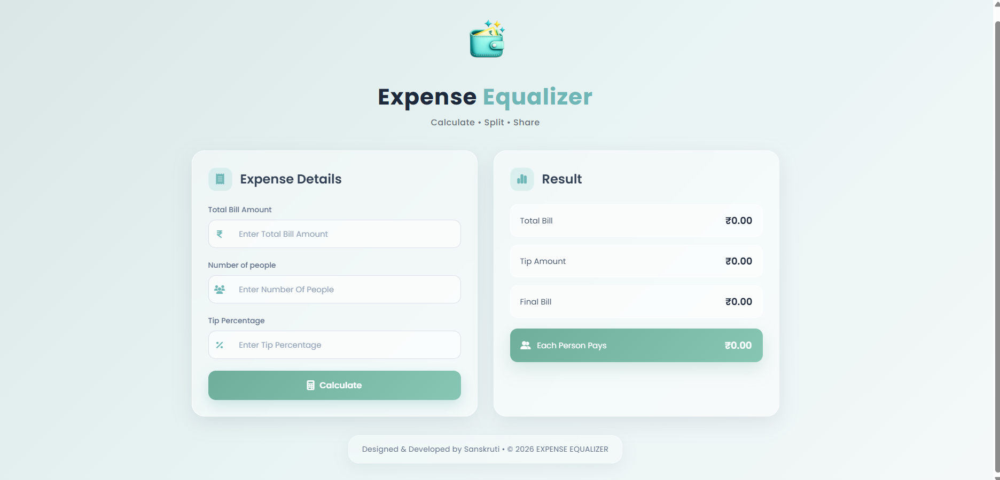

# Expense Equalizer

A beginner-friendly JavaScript project that calculates and splits expenses fairly among multiple people. Built with HTML, CSS, and JavaScript, it allows users to calculate the tip amount, total bill, and each person's share through a clean, responsive interface.

## Features

- Calculate the total bill amount.
- Calculate the tip amount based on the entered percentage.
- Split the final bill equally among multiple people.
- Display results instantly with a single click.
- Clean, modern, and responsive glassmorphism UI.
- User-friendly interface with basic input validation.

## Technologies Used

- HTML5
- CSS3
- JavaScript (ES6)
- Font Awesome
- Google Fonts (Poppins)

## Project Preview

## How to Run

1. Clone this repository.
2. Open the project folder.
3. Open the `index.html` file in your web browser.
4. Enter the bill amount, number of people, and tip percentage.
5. Click the **Calculate** button to view the results.

## Learning Outcomes

Through this project, I practiced and strengthened my understanding of:

- Variables and data types
- Functions
- Conditional statements
- Basic DOM interaction
- User input handling
- Arithmetic calculations
- Event handling
- Writing clean and readable JavaScript code

## Future Improvements

- Add a Reset button.
- Display error messages on the page instead of alert boxes.
- Improve animations and overall user experience.
- Store previous calculations using Local Storage.
- Support multiple currencies.

## Author

**Sanskruti Chikhlonde**

B.com (Computer Application) | Aspiring MERN Stack Web Developer 

## Links

**Live Website** [https://expense-equalizer.netlify.app/]

**GitHub**: https://github.com/sanskruti-chikhlonde/Expense-Equalizer